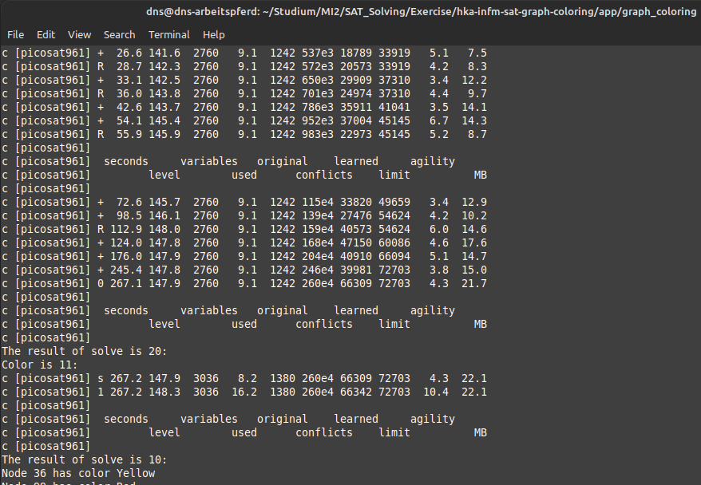

# hka-infm-graph-coloring

Exercise 1 "Coloring by Incremental SAT Challenge" for sheet 1 in course "Practical SAT Solving" at Hochschule Karlsruhe

## Task:

Implement an incremental SAT based graph vertex coloring solver in C or C++ using the IPASIR interface. Your application should take a single command line argument – a DIMACS file with a graph and find the smallest number of colors needed to color the graph. The application should print the number of colors required and the color of each vertex. 

For the technical details of implementing an incremental solver based application follow the benchmark submission instructions of the 2016 SAT Competition Incremental Track: http://baldur.iti.kit.edu/sat-competition-2016/index.php?cat=incremental.

Test instances available at http://mat.gsia.cmu.edu/COLOR/instances.html (use the *.col instances, the *.col.b are in binary format). The best (fastest) solver gets 7 bonus points.

## Compile

To compile the PicoSAT Sat Solver and the application simply execute the command `make all`. This will create an executable such as `./graph_coloring` in `./app/graph_coloring/`.

## Usage

To execute the application navigate into the app folder `./app/graph_coloring/`. After that run `./graph_coloring + <name of graph file>`. 

Such graph files you can find in `./inputs`. You can also create own graphs via the given format in the existing files. For a quick check use the `small.txt` file. 

## Arguments

The program takes a single argument. If no argument is passed it takes the `./inputs/small.txt` file.

| Option                             | Description                                                              |
|------------------------------------|--------------------------------------------------------------------------|
| `<graph file>`                     | Such graph files you can find in `./inputs`.   You can create own graphs via the given format in the existing files.  | 

## Benchmarking

PicoSAT measures the execution duration of the program. A example for `./inputs/anna.txt` looks like this:

